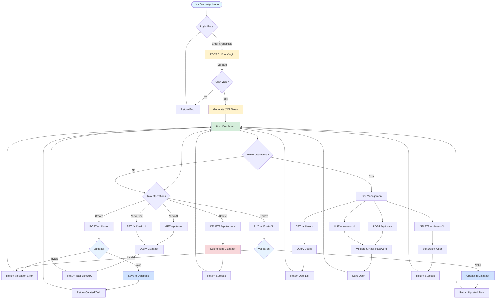
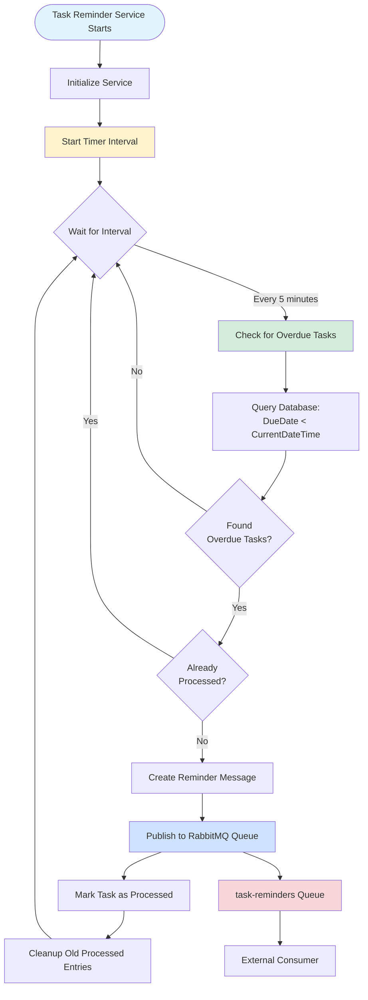
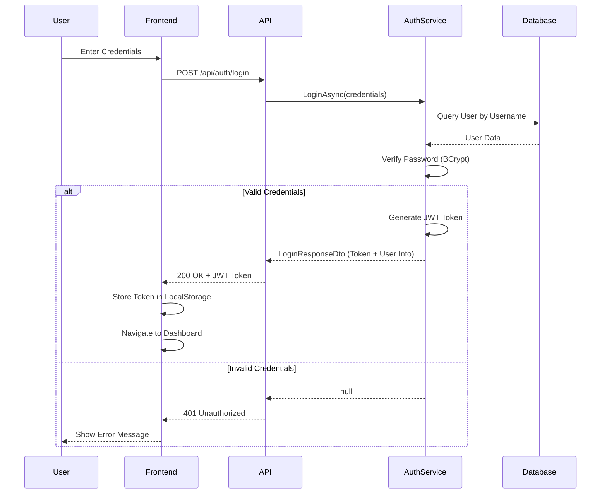
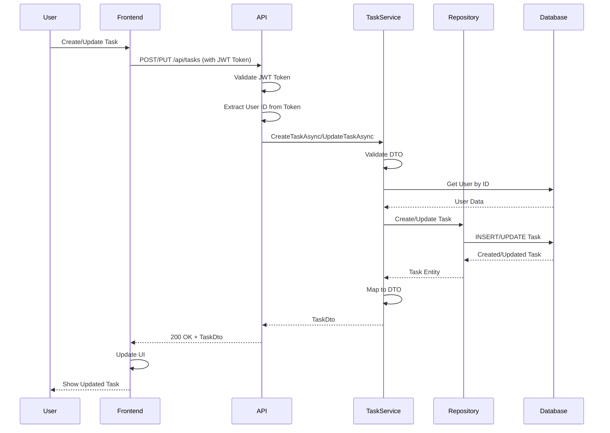

# Task Management Application

A full-stack task management application with .NET backend and React frontend.

> **⚠️ Development Setup**: This README contains default credentials and configuration for local development only. Never use these settings in a production environment.

## Prerequisites

Before running the application, make sure you have these installed:

- **.NET 8.0 SDK** - [Download here](https://dotnet.microsoft.com/download/dotnet/8.0)
- **Node.js 16+** and **npm** - [Download here](https://nodejs.org/)
- **SQL Server LocalDB** (usually comes with Visual Studio) or **SQL Server Express**

## Quick Start

### Step 1: Setup Database

1. Open a terminal in the project root directory
2. Navigate to the backend folder:
   ```bash
   cd Backend/TaskManagementAPI
   ```
3. Install Entity Framework Core tools (if not already installed):
   ```bash
   dotnet tool install --global dotnet-ef
   ```
4. Create and update the database:
   ```bash
   dotnet ef database update
   ```

### Step 2: Run the Backend

1. Make sure you're in the `Backend/TaskManagementAPI` directory
2. Run the API:
   ```bash
   dotnet run
   ```
3. The backend will start on **http://localhost:5263**
4. You can access the Swagger API documentation at **http://localhost:5263/swagger**

**Keep this terminal window open!**

### Step 2.5: Create Admin User (Development Only)

> **⚠️ IMPORTANT: This is for LOCAL DEVELOPMENT ONLY. Never use these credentials in production!**

After the backend is running, create the admin user by making a POST request to the seed endpoint:

**Option 1: Using Swagger UI (Easiest)**
1. Go to http://localhost:5263/swagger
2. Find the `POST /api/seed/admin` endpoint
3. Click "Try it out" then "Execute"
4. The admin user will be created

**Option 2: Using curl (Command Line)**
```bash
curl -X POST http://localhost:5263/api/seed/admin
```

**Default Admin Credentials (Development Only):**
- **Username**: `admin`
- **Password**: `admin123`

> **⚠️ SECURITY WARNING**: These are default development credentials with weak passwords. In a production environment, you must:
> - Use strong, unique passwords
> - Change default credentials immediately
> - Use secure password management
> - Never commit credentials to version control
> - Use environment variables or secure configuration management

### Step 3: Run the Frontend

1. Open a **new terminal window**
2. Navigate to the frontend directory:
   ```bash
   cd Backend/TaskManagementAPI/frontend
   ```
3. Install dependencies (first time only):
   ```bash
   npm install
   ```
4. Start the frontend:
   ```bash
   npm start
   ```
5. The frontend will automatically open in your browser at **http://localhost:3000**

**Keep this terminal window open too!**

## Access URLs

- **Frontend Application**: http://localhost:3000
- **Backend API**: http://localhost:5263
- **API Documentation (Swagger)**: http://localhost:5263/swagger

## Troubleshooting

### Database Connection Issues

If you get database connection errors:

1. Make sure SQL Server LocalDB is running
2. Check the connection string in `Backend/TaskManagementAPI/appsettings.json`
3. Try running the migration again:
   ```bash
   cd Backend/TaskManagementAPI
   dotnet ef database update
   ```

### Port Already in Use

If port 5263 or 3000 is already in use:

- **Backend**: Stop any other applications using port 5263, or change the port in `launchSettings.json`
- **Frontend**: Stop any other applications using port 3000, or the React app will ask to use a different port

### Frontend Can't Connect to Backend

- Make sure the backend is running on port 5263
- Check that both services are running in separate terminal windows
- Verify the API URL in the frontend code matches `http://localhost:5263/api`

### Task Reminder Service Issues

- **RabbitMQ Connection Failed**: Make sure RabbitMQ is installed and running on port 5672
- **Database Connection Error**: Verify the connection string in `App.config` matches your database
- **Service Won't Start**: Check Windows Event Viewer for error messages
- **No Reminders Published**: Verify there are overdue tasks in the database and check the service logs

## Project Structure

```
User-Task-Management/
├── Backend/
│   └── TaskManagementAPI/
│       ├── Controllers/        # API endpoints
│       ├── Services/           # Business logic
│       ├── Repositories/       # Data access
│       ├── Models/             # Database models
│       ├── DTOs/               # Data transfer objects
│       └── frontend/           # React application
├── TaskService/
│   └── TaskManagementService/
│       ├── Data/               # Data access layer
│       ├── Messaging/          # RabbitMQ messaging
│       └── Models/             # Task models
```

## Technology Stack

- **Backend**: .NET 8.0, Entity Framework Core, SQL Server
- **Frontend**: React 18, TypeScript, Redux Toolkit
- **Authentication**: JWT Bearer tokens
- **Task Reminder Service**: .NET Framework 4.7.2, RabbitMQ, Windows Service

## Data Terms

### Entity Relationship Model

The application uses three main entities:

#### User
Represents a user account in the system.

| Field | Type | Constraints | Description |
|-------|------|-------------|-------------|
| `Id` | int | Primary Key | Unique identifier for the user |
| `Username` | string | Required, Max 100 chars, Unique | User login name |
| `Email` | string | Required, Max 200 chars, Unique, Email format | User email address |
| `PasswordHash` | string | Required | BCrypt hashed password |
| `Role` | Role enum | Required | User role (User = 1, Admin = 2) |
| `FullName` | string | Max 200 chars | User's full name |
| `CreatedAt` | DateTime | Required | Account creation timestamp (UTC) |
| `UpdatedAt` | DateTime? | Nullable | Last update timestamp (UTC) |
| `IsActive` | bool | Required | Whether the account is active |

**Role Enum Values:**
- `User = 1` - Standard user with task management permissions
- `Admin = 2` - Administrator with user management permissions

#### Task
Represents a task assigned to a user.

| Field | Type | Constraints | Description |
|-------|------|-------------|-------------|
| `Id` | int | Primary Key | Unique identifier for the task |
| `Title` | string | Required, Max 200 chars | Task title |
| `Description` | string | Required, Max 1000 chars | Detailed task description |
| `DueDate` | DateTime | Required | Task due date and time |
| `Priority` | Priority enum | Required | Task priority level |
| `UserId` | int | Required, Foreign Key | Reference to User who owns the task |
| `User` | User (Navigation) | Optional | Navigation property to User entity |
| `UserFullName` | string | Required, Max 200 chars | Denormalized user full name |
| `UserEmail` | string | Required, Max 200 chars, Email format | Denormalized user email |
| `CreatedAt` | DateTime | Required | Task creation timestamp (UTC) |
| `UpdatedAt` | DateTime | Required | Last update timestamp (UTC) |

**Priority Enum Values:**
- `Low = 1` - Low priority task
- `Medium = 2` - Medium priority task
- `High = 3` - High priority task

**Relationships:**
- Many-to-One: Task → User (ForeignKey: `UserId`, Delete: Restrict)

#### Reminder
Represents a reminder notification for a task.

| Field | Type | Constraints | Description |
|-------|------|-------------|-------------|
| `Id` | int | Primary Key | Unique identifier for the reminder |
| `TaskId` | int | Required, Foreign Key | Reference to Task |
| `Task` | Task (Navigation) | Optional | Navigation property to Task entity |
| `Message` | string | Required, Max 500 chars | Reminder message content |
| `ProcessedAt` | DateTime? | Nullable | When the reminder was processed |
| `CreatedAt` | DateTime | Required | Reminder creation timestamp (UTC) |

**Relationships:**
- Many-to-One: Reminder → Task (ForeignKey: `TaskId`, Delete: Cascade)

### Database Relationships Summary

```
User (1) ────────< (Many) Task
                        │
                        │ (1)
                        │
                        │
                   (Many) Reminder
```

- **User ↔ Task**: One-to-Many (a user can have multiple tasks, each task belongs to one user)
- **Task ↔ Reminder**: One-to-Many (a task can have multiple reminders, each reminder belongs to one task)
- Task deletion is restricted if referenced by active reminders (Cascade delete for reminders)

## Process Flow

The following flowchart illustrates the main processes in the Task Management Application:



### Task Reminder Service Flow (Optional)



### Authentication Flow



### Task CRUD Flow



## Default Login Credentials (Development Only)

> **⚠️ FOR LOCAL DEVELOPMENT ONLY - DO NOT USE IN PRODUCTION**

After creating the admin user (see Step 2.5), you can log in with:

- **Username**: `admin`
- **Password**: `admin123`

These credentials are only for local development and testing. In production, you must:
- Use strong, unique passwords
- Change all default credentials
- Implement proper security measures
- Use secure configuration management

---

## 🎁 Bonus: Task Reminder Service (Optional)

> **⚠️ OPTIONAL FEATURE**: The Task Reminder Service is a **bonus feature** and is **not required** for the core application to function. The main Task Management application (Backend API + Frontend) works perfectly without it. This service adds automated reminder functionality for overdue tasks.

> **⚠️ DISCLAIMER**: 
> - This is an **advanced/optional** component that requires additional setup
> - Requires **RabbitMQ** and **.NET Framework 4.7.2** to run
> - Designed to run as a **Windows Service** (production) or can be modified for development
> - The core application functionality (creating, managing tasks) does **not depend** on this service
> - This service only provides **additional automated reminder capabilities**

The Task Reminder Service is a background Windows Service that monitors for overdue tasks and publishes reminder messages to RabbitMQ. It periodically checks the database and sends reminders for tasks that have passed their due dates.

### Prerequisites

Before setting up the Task Reminder Service, ensure you have:

1. **.NET Framework 4.7.2** - Usually comes with Windows/Visual Studio
2. **RabbitMQ** - Download from [https://www.rabbitmq.com/download.html](https://www.rabbitmq.com/download.html)
   - Or use Docker: `docker run -d --name rabbitmq -p 5672:5672 -p 15672:15672 rabbitmq:3-management`
   - Default credentials: `guest` / `guest`
   - Management UI: http://localhost:15672

### Installation & Setup

#### Step 1: Install RabbitMQ

1. **Download and install RabbitMQ** from [https://www.rabbitmq.com/download.html](https://www.rabbitmq.com/download.html)
2. **Or use Docker** (recommended for development):
   ```bash
   docker run -d --name rabbitmq -p 5672:5672 -p 15672:15672 rabbitmq:3-management
   ```
3. **Verify RabbitMQ is running**:
   - Check if RabbitMQ is running on port 5672
   - Access the management UI at http://localhost:15672 (login: guest/guest)

#### Step 2: Configuration

1. Navigate to the Task Service directory:
   ```bash
   cd TaskService/TaskManagementService
   ```

2. Update `App.config` if needed:
   - **TaskManagementDb**: Database connection string (should match your API database)
   - **RabbitMQ**: Connection string (default: `host=localhost;port=5672;username=guest;password=guest`)
   - **QueueName**: RabbitMQ queue name (default: `task-reminders`)
   - **CheckIntervalMinutes**: How often to check for overdue tasks (default: `5`)
   - **MaxConcurrentPublishes**: Maximum concurrent reminder publishes (default: `10`)

#### Step 3: Running the Service

**Option 1: Install as Windows Service (Production)**

1. Build the service:
   ```bash
   cd TaskService/TaskManagementService
   msbuild TaskManagementService.csproj /p:Configuration=Release
   ```

2. Install using sc.exe:
   ```bash
   sc.exe create TaskManagementReminderService binPath="C:\path\to\TaskManagementService.exe" start=auto
   sc.exe start TaskManagementReminderService
   ```

**Option 2: Development Mode (Requires Code Modifications)**

The service is designed as a Windows Service. For development, you would need to modify `Program.cs` to support console mode, or use a service host tool.

### How It Works

- The service periodically checks the database for tasks where `DueDate < CurrentDateTime`
- When overdue tasks are found, it publishes reminder messages to the RabbitMQ queue (`task-reminders`)
- Each reminder message includes:
  - Task details (ID, Title, Description, DueDate, Priority)
  - User information (FullName, Email)
  - Detection timestamp
- The service prevents duplicate reminders by tracking recently processed tasks
- Reminder messages are published with deduplication to avoid sending the same reminder multiple times
- Default check interval: Every 5 minutes (configurable)

### Monitoring

- **Service Logs**: Check Windows Event Viewer (Application log) or the `service.log` file in the service directory
- **RabbitMQ Queue**: Monitor the queue in the management UI (http://localhost:15672)
- **Check Interval**: The service processes overdue tasks every 5 minutes by default (configurable via `CheckIntervalMinutes` in `App.config`)

### Troubleshooting

See the [Task Reminder Service Issues](#task-reminder-service-issues) section in Troubleshooting above.

